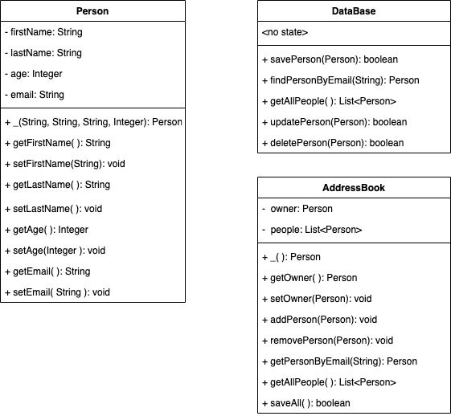

# Database Lab

The purpose of the lab is to create an address book, that can save its data in mysql. Below is the UML that describes the structure of your project. You are expected to use Test Driven Development! However, you will not need to write unit test for the DataBase Object. (This is because unit testing databases has a trick to it! You will learn that later.)

## UML




## Step 01 Setting up Database


* If you did this step on monday, you do not need to do this. However if you did not will need to get the docker image loaded on to your hard drive

```
docker pull mysql:5.7.32
```

Once that is done create the docker container:

* Before you type this in create your OWN password and replace that in the string below where you see <password> 
* Please remove the `< >` symbols from your password. 
* If you have MYSQL installed on your machine change `3306:3306` with `3308:3306`

```
docker run --name cd-address-book -p 3306:3306 -e MYSQL_ROOT_PASSWORD=<password> -d mysql:5.7.32
```

SSH or remote login to the container:

```
docker exec -it cd-address-book /bin/bash
```

Log in to mysql on the container:

```
mysql -u root -p
```

Display all of the databases:

```
show databases;
```

Create a new Database:

```
CREATE DATABASE addressbook;
```

Create a new user for the database

```
CREATE USER 'developer01' IDENTIFIED BY 'pass';
```
Grant privileges to the user:

```
GRANT ALL on addressbook.* TO 'developer01';
```


Point MYSQL to look at your table:

```
use addressbook;
```


Create table for Employees:

```
create table  IF NOT EXISTS PERSON (id VARCHAR(36), first_name VARCHAR(45), last_name VARCHAR(100), email VARCHAR(100), age INTEGER);
```

Exit Mysql:

```
quit
```

Exit Docker SSH:

```
exit
```

## Step 02 DataBase Tips

### Sample Save

```
// create a Statement from the connection
Statement statement = connection.createStatement();

// insert the data
statement.executeUpdate("INSERT INTO Customers " + "VALUES (1001, 'Simpson', 'Mr.', 'Springfield', 2001)");

```

For more information look at this link
[Link](https://alvinalexander.com/java/edu/pj/jdbc/jdbc0002/)

### Sample Read

```
try {
    String sql = "SELECT ID, NAME, DESIGNATION from EMPLOYEE";
    Statement stmt = connection.createStatement();
    ResultSet rs = stmt.executeQuery(sql);

    while(rs.next()){
        String name = rs.getString("NAME");
        System.out.println("Found "+ name);
    }
}catch(SQLException se) {
}
```

For the rest of the command you will have to do some reseach.... Good Luck!!!